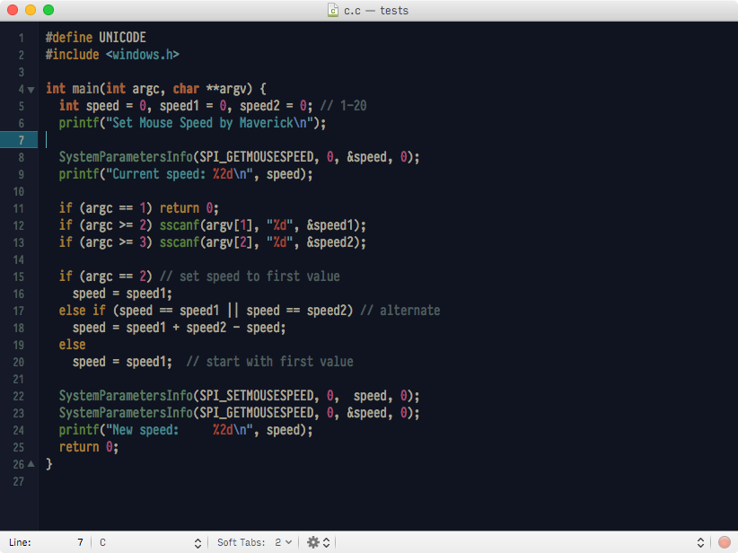
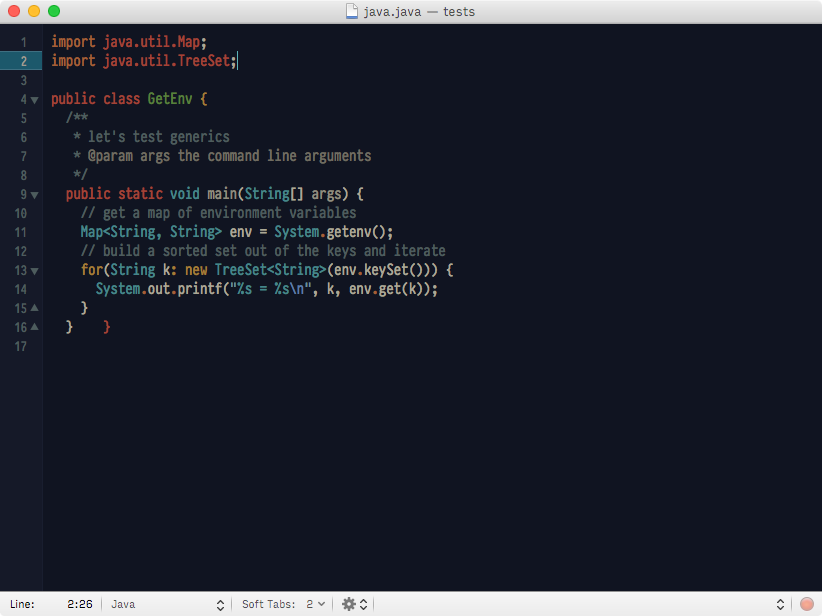
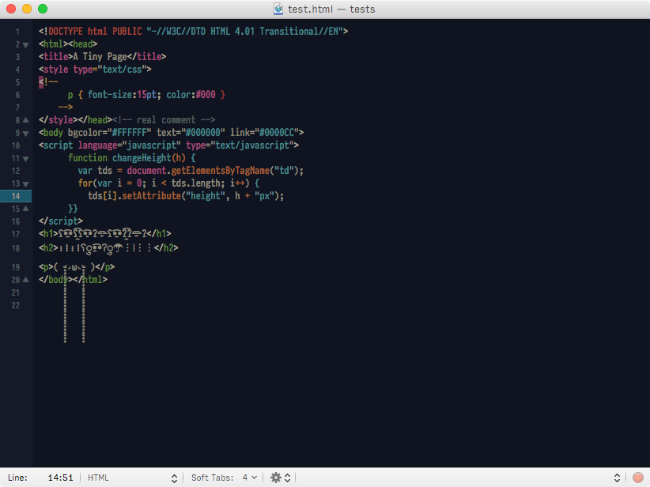
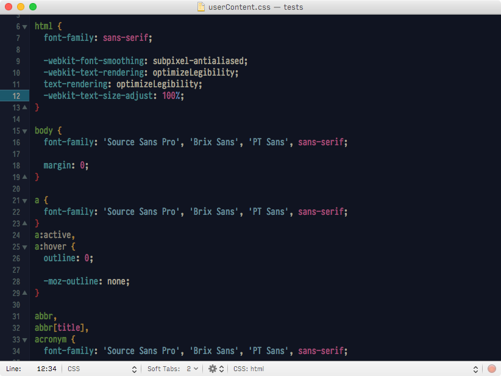

# Rococo

A dark, personal, warm theme for TextMate.

I don't like bright-on-dark themes, they burn my eyes, then:

* the white is not white
* the background is not black

I named it Rococo after the yellowish white(s) I put on the theme which remember me the rococo style, but as you can see it is rather minimal.

#### Screenshots

C

Java

HTML

XML

CSS

