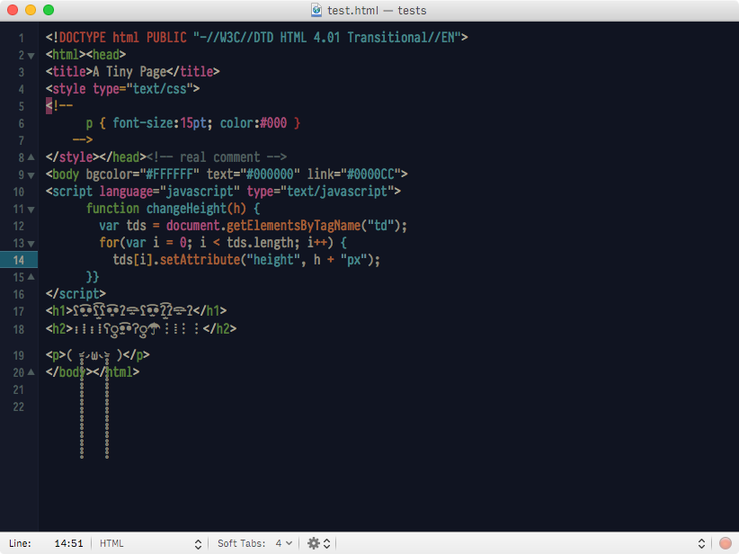

# Rococo

A dark, personal, warm theme for TextMate and Sublime Text.

I don't like bright-on-dark themes, they burn my eyes, then:

* the white is not white
* the background is not black

I named it Rococo after the yellowish white(s) I put on the theme which remember me the rococo style, but as you can see it is rather minimal.

#### Screenshots

## Installation

#### TextMate:

* Download or clone the repository in your computer, unzip and double-click on the Rococo.tmbundle, it will install itself as a bundle in TextMate.
* Or double-click on the `Rococo.tmTheme` and TextMate will ask you where to install the theme, choose 'Themes' or your user folder.

#### Sublime Text (for now):

* Download or clone the repository.
* Find your Packages directory using the menu item `Preferences > Browse Packages...`
* Create a folder `Theme - Rococo` in your Sublime Text `Packages` directory and copy-paste the `Rococo.tmTheme` in `Theme - Rococo`.
* Go in `Sublime Text > Preferences > Color Scheme > Theme - Rococo` to activate the theme.

